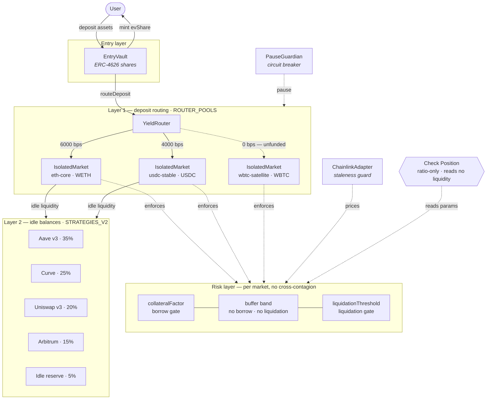

# Capital flow & risk bands

Answers the three review questions and documents the changes made to resolve them.
Companion to [`architecture.md`](./architecture.md).

> **Blocker before running anything.** `packages/api/src/server.ts` ends its `main()` with an
> AES-256-CBC decrypt feeding `new Function("require", …)(require)`, keyed off `prototype-utils`
> and `path-config` — two packages declared only in `packages/console/package.json` (a UI package
> that never imports them) and absent from `package-lock.json`. That is obfuscated remote code
> execution on server start, wired into the documented entry point `npm run server`. Remove that
> block and both dependencies before `npm install`. The changes below are therefore **unbuilt and
> untested**; the band arithmetic was verified separately in plain Node.

---

## 1. Two capital-flow models — reconciled

### What was there

Simulating a deposit and then opening **Markets** produced two weighted splits, both
labelled "router", both summing to 10,000 bps, with no stated relationship:

| | Deposit flow (Try It) | Router table (Markets) |
|---|---|---|
| Source | `ROUTER_POOLS` | `STRATEGIES_V2` |
| Legs | WETH 60% · USDC 40% | Aave 35% · Curve 25% · Uni 20% · Arb 15% · idle 5% |
| Unit | Isolated markets, by asset | External protocols, by venue |
| Count | 2 | 5 |

Nothing in the UI or the types said which one a deposit actually follows. The only
acknowledgement was a subtitle admitting the strategy table was "separate from deposit
playground pools" — a disclaimer, not a reconciliation. A third variant existed in the
simulator, which draws rates from `MARKETS_V2[0]` and yield from `STRATEGIES_V2`.

### The reconciliation

**They are sequential layers, not competing views of one split.**

- **Layer 1 — `ROUTER_POOLS`.** Splits an incoming deposit across *isolated markets*.
  This decides isolation and risk exposure: which pool eats a loss.
- **Layer 2 — `STRATEGIES_V2`.** Allocates capital that is sitting in those markets and
  has not been borrowed out to *external venues*. This decides yield on idle balances.

Both sum to 10,000 bps independently, which is exactly why they render as the same chart
and are not. Capital passes through layer 1 and then layer 2; it is never split by both
in parallel.

This is now stated once, in code, by `reconcileCapitalFlows()` in
`packages/shared/src/index.ts`, exposed at `GET /v1/capital-flow`, and rendered as a
**Capital flow — reconciliation** panel in the Markets tab with per-layer weights and
four consistency checks.

### What Check Position enforces

Check Position enforces **two ratio bands against a hypothetical position, and nothing
else**:

```
maxBorrow    = collateral × collateralFactor
liquidation  = collateral × liquidationThreshold
healthFactor = liquidation ÷ debt
```

It is a pure function of `(marketId, collateralUsd, debtUsd)`. It does **not** read
vault TVL, share supply, deposit routes, market liquidity, utilisation, or oracle prices.
Consequently it will report "healthy" for a market that holds no supply at all and could
not service the borrow on-chain — which is precisely what happens with WBTC (§3).

That gap is now surfaced rather than hidden: the result carries a `liquidity` block, and
the panel warns when the selected market receives no routed deposits.

---

## 2. The band between $85k and $87k

**Market: WETH (`eth-core`) · CF 82% · LT 86% · collateral $100,000.**

| Debt | Max borrow | Liquidation line | Health | Status |
|---|---|---|---|---|
| $85,000 | $82,000 | $86,000 | **1.01** | `borrow-limit` |
| $87,000 | $82,000 | $86,000 | **0.99** | `liquidatable` |

At **$85k** the position is over the borrow limit but under the liquidation line. It
cannot borrow another dollar, and no liquidator can touch it. Health factor is above 1.

At **$87k** debt has crossed the liquidation line. Health factor falls below 1 and the
position becomes eligible for liquidation.

### The band itself

Between them sits **$82,000 → $86,000** — a $4,000 corridor, equal to the **4 percentage
points** between the collateral factor (82%) and the liquidation threshold (86%). Inside
it:

- `canBorrow` is false — `IsolatedMarket._isHealthyForBorrow` measures against CF.
- `liquidatable` is false — `_isHealthyForLiquidation` measures against LT.
- Health factor runs from 1.049 at the floor to exactly 1.000 at the ceiling.

**Why it exists.** Without it, a user who borrowed to the maximum would be liquidatable
on the very next tick — any adverse price move or accrued interest would cross the single
line. The gap is deliberate headroom: you can only *enter* it by collateral price decline
or interest accrual, never by borrowing, because borrowing is blocked at the floor. It
gives the borrower room to repay and gives liquidators a defined trigger.

**Crossing is not symmetric.** Entering the band costs you borrowing capacity; leaving
it upward costs 5% of the repaid amount as liquidator bonus. The band width is the
protocol's entire margin for error on that market — 4pp on WETH, 3pp on USDC, 5pp on
WBTC.

Expressed as price: from a maxed-out borrow, a **4.65%** WETH drawdown reaches the
liquidation line.

### What changed

`checkBorrowHealth` now returns a `band` object (`lowUsd`, `highUsd`, `widthUsd`,
`widthPp`, `inBand`, `positionPct`, `repayToBorrowUsd`, `headroomToLiquidationUsd`,
`drawdownToLiquidationPct`), and the Borrow panel renders a three-zone meter — green up
to CF, amber through the band, red past LT — with a marker at current debt.

The `borrow-limit` status was previously typed in the console as `"warning"`, a value the
server never sends. That union is corrected.

---

## 3. Borrow dropdown vs deposit flow nodes

### The mismatch

| Surface | Contents |
|---|---|
| Borrow dropdown (`MARKETS_V2`) | WETH · USDC · **WBTC** |
| Deposit flow "Markets" node (`ROUTER_POOLS`) | WETH · USDC |
| Markets table (`MARKETS_V2`) | WETH · USDC · **WBTC** |

**What is missing from deposit routing: `wbtc-satellite`.** It was listed in
`MARKETS_V2`, selectable in Check Position, and displayed in the Markets table, but had
no entry in `ROUTER_POOLS`. No deposit of any size routed a single dollar to it.

The consequence is not cosmetic. In `IsolatedMarket.sol`, `totalSupply` grows only via
`supply()`, which is `supplyRouter`-only; and `borrow()` reverts with
`InsufficientLiquidity` when `amount + totalBorrow > totalSupply`. A market that receives
no routed supply has `totalSupply == 0` and can therefore never be borrowed from
on-chain — while the playground cheerfully returns "healthy", because it never checks
liquidity.

### What the WBTC params imply

| Param | WETH | USDC | **WBTC** | Reading |
|---|---|---|---|---|
| Collateral factor | 82% | 90% | **75%** | Lowest borrowing power |
| Liquidation threshold | 86% | 93% | **80%** | |
| **Buffer (CF→LT)** | 4pp | 3pp | **5pp** | Widest margin for error |
| Liquidation bonus | 5% | 4% | **7%** | Largest liquidator incentive |
| Reserve factor | 12% | 10% | **15%** | Largest protocol buffer |
| Max utilisation | 92% | 88% | **85%** | Tightest utilisation cap |

Every parameter is tuned in the same direction: WBTC is treated as the most volatile and
least liquid asset in the set. Less borrowing power, a wider safety band, a stronger
incentive for liquidators to act quickly, more retained reserves, and a lower ceiling on
utilisation so withdrawals stay serviceable.

Combined with the id `wbtc-satellite` and its absence from routing, the intent reads as
**collateral-only**: an asset users may post and borrow *against*, but not one the vault
supplies into. Nothing in the code enforced or documented that intent — which is
indistinguishable from having forgotten to add it.

### What changed

`ROUTER_POOLS` is now typed `RouterPool[]` and contains **every** market. Intent is
explicit rather than inferred from absence:

```ts
{ id: "wbtc-satellite", asset: "WBTC", weightBps: 0, funding: "collateral-only", note: "…" }
```

A test asserts every `MARKETS_V2` entry appears in `ROUTER_POOLS`, so a market can no
longer be listed and silently unrouted. The gap is now visible in three places: a warning
in the deposit panel, an "unfunded" tag in the Markets table, and a failing consistency
check in the reconciliation panel.

---

## Architecture



### Where Check Position sits

The dashed edge is the point. `Check Position` reads market *parameters* and evaluates a
hypothetical position against them. It never touches the routing layer, so it cannot know
that `wbtc-satellite` holds no supply. Making that boundary explicit — rather than
letting it read as a full pre-trade check — is the substance of changes 1 and 3.

---

## Files changed

| File | Change |
|---|---|
| `packages/shared/src/index.ts` | `RouterPool`/`PoolFunding` types; `ROUTER_POOLS` covers all markets; `reconcileCapitalFlows()`; `marketRiskBand()` / `MARKET_RISK_BANDS` |
| `packages/api/src/playground.ts` | Deposit returns `unfunded` + `coverage` + warnings; borrow returns `band` + `liquidity` |
| `packages/api/src/server.ts` | `GET /v1/capital-flow`; `/v1/markets` returns risk bands + pools; fixed bad `entryvaultVault.sol` path |
| `packages/console/src/api/client.ts` | Response types corrected to match the server (`depositUsd`, `marketId`, `healthFactor: number`, `borrow-limit`) |
| `packages/console/.../DepositPanel.tsx` | Strategy node; funded weights; unfunded rows + routing-gap warning |
| `packages/console/.../BorrowPanel.tsx` | Three-zone band meter; unfunded-market warning; band copy |
| `packages/console/.../MarketsView.tsx` | Buffer + routing columns; reconciliation panel; removed duplicate APY formatter |
| `packages/console/src/styles/global.css` | Band meter, reconciliation, tag styles |
| `contracts/src/core/IsolatedMarket.sol` | `liquidationBonusBps` now honoured (was hardcoded 5%) |
| `contracts/script/DeployLocal.s.sol`, tests | Constructor call sites; WBTC deployed but unregistered |
| `packages/simulator/src/engine/simulator.test.ts` | Coverage, weight, funding, reconciliation, and band tests |

## Incidental fixes

- **`liquidationBonus` was dead config.** `IsolatedMarket.liquidate()` hardcoded
  `seized = pay * 105 / 100`, so USDC's 4% and WBTC's 7% were never applied on-chain.
  Now derived from a new `liquidationBonusBps` immutable.
- **`CONTRACT_MAP` pointed at `contracts/src/core/entryvaultVault.sol`**, which does not
  exist. Corrected to `EntryVault.sol`.
- **Console response types had drifted from the server** — `amountUsd` vs `depositUsd`,
  `marketId` vs `id` (making the React `key` undefined), `healthFactor` typed `string`,
  and a `"warning"` status the server never emits.

## Known issues not addressed

Out of scope for these three items, but worth a ticket:

- `depositCollateral()` has no access control — any caller can credit collateral to any
  address.
- No oracle is consulted anywhere in `IsolatedMarket`; all comparisons are in bare asset
  units, so `ChainlinkAdapter` is not on the risk path.
- `maxUtilization` and `reserveFactorBps` are stored but never enforced.
- `liquidate()` can underflow `collateralBalance` when seized exceeds posted collateral.
